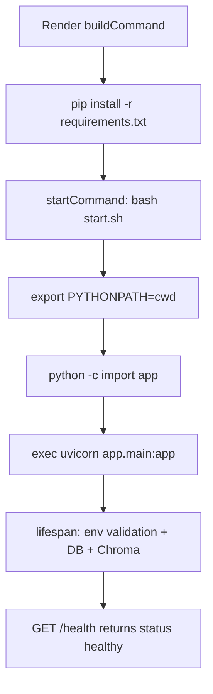

# Package Structure & Startup Flow

## Package layout

```
ai-email-intelligence/          ← PYTHONPATH root (Render: /opt/render/project/src)
├── app/                        ← Python package
│   ├── __init__.py
│   ├── main.py                 ← FastAPI entry: app = FastAPI(...)
│   ├── config.py
│   ├── graph.py
│   ├── startup_validation.py
│   ├── agents/                 ← relative imports (from ..config)
│   ├── auth/
│   ├── db/
│   ├── evaluation/
│   ├── retriever/
│   ├── services/
│   └── utils/
├── scripts/                    ← bootstrap sys.path → from app...
├── start.sh                    ← production entrypoint
├── render.yaml
├── Procfile
└── requirements.txt
```

## Startup flow (Render)



## Import dependency graph

```mermaid
flowchart TB
    main[app.main] --> config[app.config]
    main --> graph[app.graph]
    main --> auth[app.auth.clerk]
    main --> db[app.db.database]
    main --> services[app.services.dashboard]
    main --> startup[app.startup_validation]
    graph --> agents[app.agents.*]
    graph --> evaluation[app.evaluation.pipeline]
    agents --> retriever[app.retriever]
    retriever --> chromadb[(chromadb)]
    agents --> base[app.agents.base]
    base --> langchain[langchain_anthropic]
```

## Execution path

1. **Build:** `pip install -r requirements.txt`
2. **Start:** `bash start.sh` sets `PYTHONPATH=$(pwd)` and runs `uvicorn app.main:app`
3. **Import:** `app.main` uses relative imports within package
4. **Lifespan:** env validation, optional DB/Chroma init (non-fatal)
5. **Health:** `GET /` and `GET /health` — no external services

## Single production entrypoint

```bash
bash start.sh  →  uvicorn app.main:app --host 0.0.0.0 --port $PORT
```

Do **not** use `python cli.py serve` or `pip install` as Start Command on Render.
