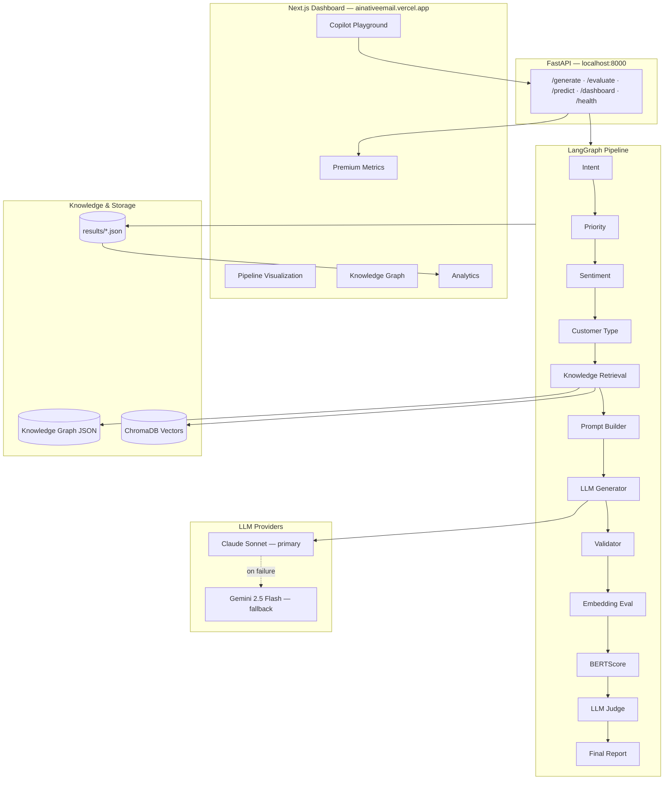
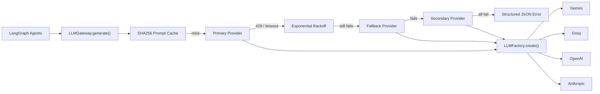

# AI Native Email Intelligence Platform

[](https://github.com/vijayshreepathak/AI-Native-Email-Intelligence)

Production-quality AI email reply platform inspired by **Hiver AI Copilot**. It ingests customer support emails, runs a multi-agent LangGraph pipeline, retrieves company knowledge, generates validated replies, and scores quality with BERTScore, embeddings, and an LLM judge — all exposed through a FastAPI backend and a polished Next.js AI Operations dashboard.

**Live app:** [https://ainativeemail.vercel.app/](https://ainativeemail.vercel.app/)  
**Repository:** [github.com/vijayshreepathak/AI-Native-Email-Intelligence](https://github.com/vijayshreepathak/AI-Native-Email-Intelligence)

---

## Architecture



### Tech Stack

| Layer | Technology | Role |
|-------|------------|------|
| Orchestration | **LangGraph** | Stateful multi-agent workflow |
| LLM (primary) | **Claude Sonnet 4.6** | Classify, generate, validate, judge |
| LLM (fallback) | **Gemini 2.5 Flash** | Automatic fallback when Claude fails |
| Vector DB | **ChromaDB** | Semantic policy/FAQ retrieval |
| Embeddings | **ChromaDB ONNX** (prod) · **SentenceTransformers** (eval profile) | RAG retrieval; full local embeddings via `requirements-evaluation.txt` |
| API | **FastAPI** | Async REST endpoints |
| Dashboard | **Next.js 16 + Framer Motion** | AI Ops console UI |
| Evaluation | **BERTScore + Embeddings + LLM Judge** | Multi-metric quality scoring |

> **Important:** Production deployments use a **lightweight dependency profile** (`requirements.txt`) without Torch, Sentence Transformers, or BERTScore. See [Dependency Profiles](#dependency-profiles) below — evaluation metrics still run in production via **LLM judge + lightweight fallbacks**, but research-grade embedding/BERTScore scoring requires `requirements-evaluation.txt` locally.

---

## Dependency Profiles

This project intentionally uses **three dependency profiles**. Many users clone expecting every AI evaluation feature (BERTScore, Sentence Transformers, Torch, embedding similarity) to work immediately after `pip install -r requirements.txt`. **That is by design not the case in production** — heavy ML packages are excluded to keep the backend lightweight and deployable on Render.

### 1. `requirements.txt` — Production runtime

**Purpose:** Serve live API traffic with minimal footprint.

**Used by:**

- [Render](https://render.com) (backend)
- Railway
- Docker
- All production deployments

**Includes:**

- FastAPI + Uvicorn
- LangGraph + LangChain
- Anthropic (Claude)
- ChromaDB (built-in ONNX embeddings for RAG — no Torch required)
- SQLAlchemy + psycopg2 (Neon PostgreSQL)
- PyJWT (Clerk authentication)
- NumPy (lightweight fallbacks)

**Production intentionally excludes:**

- Torch
- Sentence Transformers
- BERTScore
- RapidFuzz

This reduces:

- Deployment download size (~70–80% smaller)
- Cold start time on Render free tier
- Memory usage (512MB-friendly)
- Build failures (SSL / PyTorch wheel issues on `download.pytorch.org`)

**Production behavior without heavy ML deps:**

| Endpoint | Works? | Notes |
|----------|--------|-------|
| `POST /generate` | ✅ | Full LangGraph generation + RAG |
| `POST /predict` | ✅ | Classification only |
| `POST /evaluate` | ✅ | LLM judge always runs; BERTScore/embedding similarity use **lightweight fallbacks** |
| `GET /dashboard` | ✅ | Per-user metrics via Neon |

---

### 2. `requirements-dev.txt` — Contributors & local tooling

**Purpose:** Everything in production **plus** developer workflow tools.

**Includes** (via `-r requirements.txt`):

- **pytest** + pytest-asyncio — test suite
- **typer** + **rich** — CLI (`cli.py`) and scripts

**Install:**

```bash
pip install -r requirements-dev.txt
```

Use this profile for day-to-day local backend development, running tests, and CLI commands.

---

### 3. `requirements-evaluation.txt` — Research-grade evaluation

**Purpose:** Install optional heavy ML packages for **full** offline evaluation fidelity.

**Includes** (via `-r requirements.txt`):

- **Torch** (PyPI only — never `download.pytorch.org`)
- **Sentence Transformers** (`all-MiniLM-L6-v2`)
- **BERTScore**
- **RapidFuzz**

**Enables:**

- Semantic similarity (embedding cosine)
- BERTScore F1 / precision / recall
- Offline benchmarking on `dataset/test.json`
- Research experiments and model comparison
- Reproducible evaluation papers / ablations

These packages are **optional** and **not required** for production inference or the live dashboard.

**Install:**

```bash
pip install -r requirements-evaluation.txt
```

> **Tip:** `requirements-evaluation.txt` already includes `requirements.txt`. You do not need to install both separately.

---

### Feature availability by profile

| Feature | Production (`requirements.txt`) | Local Evaluation (`requirements-evaluation.txt`) |
|---------|--------------------------------|--------------------------------------------------|
| FastAPI API | ✅ | ✅ |
| LangGraph | ✅ | ✅ |
| Claude | ✅ | ✅ |
| Gemini Fallback | ✅ | ✅ |
| ChromaDB RAG | ✅ | ✅ |
| PostgreSQL (Neon) | ✅ | ✅ |
| Clerk Authentication | ✅ | ✅ |
| Dashboard | ✅ | ✅ |
| Analytics | ✅ | ✅ |
| Semantic Similarity | ❌ (fallback) | ✅ |
| Sentence Transformers | ❌ | ✅ |
| BERTScore | ❌ (fallback) | ✅ |
| Torch Evaluation | ❌ | ✅ |
| Embedding Similarity | ❌ (fallback) | ✅ |

**Fallback behavior in production:** When Torch/BERTScore/Sentence Transformers are absent, the evaluation pipeline uses token-overlap and hash-based embedding fallbacks so `/evaluate` never crashes — scores differ from full local evaluation.

---

## Features

### Backend Pipeline
- **12-node LangGraph workflow** with per-node latency, tokens, and error tracking
- **30 support intents** — billing, refunds, API, security, sync errors, permissions, etc.
- **Knowledge graph traversal** (9 nodes) + ChromaDB vector search (top-3 docs)
- **Structured JSON generation** with citations and confidence scores
- **Validation agent** — hallucination, tone, grammar, completeness, policy compliance
- **LLM judge** — 8 criteria with weighted overall score
- **Gemini fallback** — if Claude key expires or credits run out, pipeline auto-switches to Gemini

### Next.js AI Operations Dashboard
- **Premium metric cards** — AI Quality, latency breakdown, token usage, grounded responses %
- **Copilot Playground** — Generate or Evaluate modes with 8 sample tickets
- **Live pipeline visualization** — animated LangGraph nodes with auto-scroll
- **Interactive knowledge graph** — click nodes for policies, FAQs, templates
- **Retrieval panel** — similarity, matched concepts, index status
- **AI Quality Checklist** — pass/fail gates with 6/7 style scoring
- **LLM Judge panel** — enhanced radar chart + strengths/weaknesses/suggestions
- **Score explainability** — weighted breakdown of why overall = X%
- **Execution timeline** — per-node latency bars
- **Analytics section** — quality trends, grounding, latency, intent distributions
- **Dark/light mode**, keyboard shortcuts, responsive layout

---

## Screenshots

### Platform features
Overview of all capabilities — LangGraph pipeline, RAG, validation, LLM judge, knowledge graph, and REST API.


### Dashboard — generated reply
Copilot Playground with sample tickets. After clicking **Generate Reply**, the right panel shows intent, priority, sentiment, and the AI-drafted response.


### Live pipeline visualization
LangGraph nodes animate in sequence while the pipeline runs — each step shows latency, tokens, and status. Scrolling stays inside the panel.


### Full evaluation
**Evaluate** mode compares the generated reply against a reference response with BERTScore, embedding similarity, and LLM judge scores.


### Analytics
Historical quality trends, grounding scores, latency charts, and intent distributions — scroll down from the playground or use the **Analytics** button.


---

## Quick Start

### Use the live app

1. Open **[https://ainativeemail.vercel.app/](https://ainativeemail.vercel.app/)**
2. **Sign in** with Clerk (top-right) — your history is private to your account
3. Pick a sample ticket → **Generate Reply** or switch to **Evaluate**
4. Click **Sync** if metrics show dashes (Render free tier may need a moment to wake)

See **[RENDER_DEPLOY.md](./RENDER_DEPLOY.md)** for full production setup (Render + Vercel + Neon + Clerk).

---

### Local development

Requires **Python 3.12+** (`runtime.txt` pins 3.12.8 for Render).

Choose the dependency profile that matches your goal:

#### Production-only install (matches Render)

Minimal footprint — same packages deployed to production:

```bash
pip install -r requirements.txt
uvicorn app.main:app --reload --port 8000
```

#### Contributor install (recommended for most local work)

Production deps + CLI + pytest:

```bash
pip install -r requirements-dev.txt
```

#### Full evaluation install (research / benchmarking)

All production deps + Torch + BERTScore + Sentence Transformers:

```bash
pip install -r requirements-evaluation.txt
python scripts/validate_startup.py   # verify imports
pytest tests/ -v                     # run evaluation tests
```

Quick reference:

```bash
pip install -r requirements.txt              # production / Render parity
pip install -r requirements-dev.txt          # + CLI, pytest
pip install -r requirements-evaluation.txt   # + torch, BERTScore, full metrics
```

#### 1. Clone & install

```bash
git clone https://github.com/vijayshreepathak/AI-Native-Email-Intelligence.git
cd AI-Native-Email-Intelligence

python -m venv .venv
.venv\Scripts\activate          # Windows
pip install -r requirements-dev.txt   # includes production deps + CLI + pytest
```

#### 2. Configure environment

You need **two** env files:

| File | Template | Used by |
|------|----------|---------|
| `.env` | [`.env.example`](./.env.example) | FastAPI backend (LLM, DB, Clerk) |
| `dashboard/.env.local` | [`dashboard/.env.local.example`](./dashboard/.env.local.example) | Next.js dashboard |

**Backend** — copy the template, then paste your keys:

```bash
cp .env.example .env          # Mac/Linux
copy .env.example .env        # Windows
```

Open `.env` and fill in the sections below (same layout as `.env.example`):

```env
# ── Primary Provider ─────────────────────────────────────────────────────────
LLM_PROVIDER=gemini
LLM_MODEL=gemini-2.5-flash-lite

# ── First Fallback ───────────────────────────────────────────────────────────
FALLBACK_PROVIDER=groq
FALLBACK_MODEL=llama-3.3-70b-versatile

# ── Second Fallback ──────────────────────────────────────────────────────────
SECONDARY_PROVIDER=openai
SECONDARY_MODEL=gpt-4.1-mini

# ── API Keys (paste from provider dashboards) ────────────────────────────────
GEMINI_API_KEY=xxxxxxxxxxxxxxxxx
GROQ_API_KEY=gsk_xxxxxxxxxxxxxxx
OPENAI_API_KEY=sk-xxxxxxxxxxxxxx
ANTHROPIC_API_KEY=sk-ant-xxxxxxxx

# ── General LLM Parameters ───────────────────────────────────────────────────
TEMPERATURE=0
MAX_TOKENS=4096
MAX_RETRIES=5
REQUEST_TIMEOUT=60
```

> **Tip:** You only need **one** API key to start (e.g. `GEMINI_API_KEY`). Failover providers are skipped until their keys are set.

| Key | Get it from |
|-----|-------------|
| `GEMINI_API_KEY` | [Google AI Studio](https://aistudio.google.com/apikey) |
| `GROQ_API_KEY` | [Groq Console](https://console.groq.com/keys) |
| `OPENAI_API_KEY` | [OpenAI API Keys](https://platform.openai.com/api-keys) |
| `ANTHROPIC_API_KEY` | [Anthropic Console](https://console.anthropic.com/settings/keys) |

**Dashboard** — copy and edit `dashboard/.env.local`:

```bash
cd dashboard
cp .env.local.example .env.local    # Mac/Linux
copy .env.local.example .env.local  # Windows
```

Paste these values:

```env
# Local backend (must match uvicorn port)
NEXT_PUBLIC_API_URL=http://127.0.0.1:8000

# Optional — leave blank for local dev without sign-in
NEXT_PUBLIC_CLERK_PUBLISHABLE_KEY=pk_test_...
CLERK_SECRET_KEY=sk_test_...
```

| File | Variable | Where to paste from |
|------|----------|---------------------|
| `dashboard/.env.local` | `NEXT_PUBLIC_API_URL` | `http://127.0.0.1:8000` locally · Render URL in production |
| `dashboard/.env.local` | `NEXT_PUBLIC_CLERK_PUBLISHABLE_KEY` | [Clerk Dashboard](https://dashboard.clerk.com/) → API Keys |
| `dashboard/.env.local` | `CLERK_SECRET_KEY` | Same Clerk page → Secret key |

See [Environment Variables](#environment-variables) for production vars (Neon, Clerk JWT on Render, CORS).

#### 3. Index knowledge base

```bash
python scripts/embed_knowledge.py embed
```

#### 4. Start backend (Terminal 1)

```bash
uvicorn app.main:app --reload --port 8000
# API → http://127.0.0.1:8000
# Docs → http://127.0.0.1:8000/docs
```

#### 5. Start dashboard (Terminal 2)

```bash
cd dashboard
cp .env.local.example .env.local   # first time only — then edit values
npm install                        # first time only
npm run dev
# UI → http://localhost:3000
```

#### 6. Try it

1. Open **http://localhost:3000**
2. Click a **Sample Ticket** (e.g. OAuth / Gmail Sync Error)
3. Click **Generate Reply** (~60s) or switch to **Evaluate** for full scoring
4. Explore tabs: **Reply · Pipeline · Graph · Quality · Retrieval · Judge · Insights**
5. Scroll down for **Analytics**

---

## Pipeline Steps

| # | Node | Description |
|---|------|-------------|
| 1 | Intent Agent | Classifies into 30 support intents |
| 2 | Priority Agent | critical / high / medium / low |
| 3 | Sentiment Agent | Customer sentiment analysis |
| 4 | Customer Agent | enterprise, business, pro, etc. |
| 5 | Knowledge Agent | Graph traversal + ChromaDB top-3 retrieval |
| 6 | Prompt Builder | Assembles context-rich prompt |
| 7 | Generator Agent | LLM produces structured JSON reply |
| 8 | Validator Agent | Hallucination, tone, grammar, policy checks |
| 9 | Embedding Evaluation | Cosine similarity vs expected reply |
| 10 | BERTScore | Semantic F1 overlap |
| 11 | LLM Judge | 8-criteria quality assessment |
| 12 | Final Report | Weighted score + feedback |

---

## API Endpoints

| Method | Path | Description |
|--------|------|-------------|
| `GET` | `/health` | Status, model, Chroma index, fallback availability |
| `POST` | `/predict` | Classification only (intent, priority, sentiment) |
| `POST` | `/generate` | Full generation pipeline |
| `POST` | `/evaluate` | Generation + BERTScore + judge + metrics |
| `GET` | `/dashboard` | Aggregated metrics for analytics UI |

### Examples

```bash
# Health
curl http://127.0.0.1:8000/health

# Generate
curl -X POST http://127.0.0.1:8000/generate \
  -H "Content-Type: application/json" \
  -d '{"subject":"Gmail sync broken","email":"Our shared inbox stopped syncing. 12 agents affected.","customer_name":"Maria"}'

# Evaluate
curl -X POST http://127.0.0.1:8000/evaluate \
  -H "Content-Type: application/json" \
  -d '{"subject":"Refund request","email":"I want a pro-rated refund.","expected_response":"Your refund is approved within 5-10 business days."}'
```

---

## LLM Fallback

```
Claude (primary)  →  success  →  use Claude response
                 ↘  failure (expired key, no credits, rate limit)
                    Gemini (fallback)  →  use Gemini response
```

Configured in `app/agents/base.py`. No pipeline changes needed — fallback is transparent to all agents.

---

## Knowledge Graph

9 interconnected nodes in `knowledge/knowledge_graph.json`:

**Billing · Refund · Shipping · Technical · Security · Account · API · Subscription · Permissions**

Each node has policies, FAQs, response templates, escalation rules, and related-node links. Intent-to-node mapping drives targeted retrieval during inference.

---

## Evaluation

> For **full** BERTScore and embedding similarity scores, install [`requirements-evaluation.txt`](#3-requirements-evaluationtxt--research-grade-evaluation). Production uses LLM judge + lightweight fallbacks — see [Dependency Profiles](#dependency-profiles).

| Metric | Weight | Description |
|--------|--------|-------------|
| LLM Judge | 35% | 8 criteria vs expected reply |
| Embedding Similarity | 35% | Sentence embedding cosine similarity |
| BERTScore | 30% | Contextual F1 score |

**Judge criteria:** Correctness, Completeness, Empathy, Professionalism, Actionability, Safety, Hallucination, Policy Adherence

**Validation checks:** No hallucination, action items, professional tone, grammar, completeness, policy compliance

---

## Dataset Generation

```bash
python scripts/generate_dataset.py generate
```

Generates 300 synthetic Hiver-style emails (30 intents × 10). Features incremental checkpoint saves, retry with backoff, deduplication, and train/val/test split.

---

## Project Structure

```
ai-email-intelligence/
├── app/                     # FastAPI + LangGraph backend
│   ├── agents/              # Pipeline agent nodes (call LLMGateway only)
│   ├── llm/                 # Provider-agnostic LLM gateway
│   │   ├── gateway.py       # Retries, caching, failover
│   │   ├── factory.py       # LLMFactory.create(provider)
│   │   └── providers/       # gemini, groq, openai, anthropic
│   ├── retriever/           # ChromaDB + knowledge graph
│   ├── evaluation/          # BERTScore, embeddings, judge
│   ├── services/            # Dashboard aggregation
│   └── main.py              # API entry point
├── dashboard/               # Next.js AI Operations UI
│   └── src/
│       ├── app/             # Pages + API routes
│       └── components/      # Pipeline viz, metrics, analytics, etc.
├── knowledge/               # Graph, policies, FAQs, templates, ChromaDB
├── dataset/                 # train / validation / test JSON
├── scripts/                 # embed_knowledge, generate_dataset, test_llm_fallback
├── results/                 # generated.json, evaluation.json, dashboard.json
├── Screenshots/             # UI screenshots for README
├── cli.py                   # Typer CLI (local dev — production uses start.sh)
├── requirements.txt         # Production runtime (Render)
├── requirements-dev.txt     # + pytest, typer, rich
├── requirements-evaluation.txt  # + torch, BERTScore, sentence-transformers
├── start.sh                 # Production entrypoint (Render)
├── render.yaml              # Render Blueprint
├── PACKAGE.md               # Package structure & import graph
├── RENDER_DEPLOY.md         # Render deployment checklist
└── README.md
```

---

## CLI

```bash
python cli.py serve --port 8000
python cli.py generate-reply "Subject" "Email body" --name "Customer"
python cli.py evaluate-dataset --split test --limit 5
python scripts/test_llm_fallback.py    # verify LLM gateway + failover
```

---

## Tests

Requires `requirements-dev.txt` (includes pytest):

```bash
pip install -r requirements-dev.txt
pytest tests/ -v
```

Evaluation-specific tests (`tests/test_evaluation.py`) additionally require:

```bash
pip install -r requirements-evaluation.txt
pytest tests/test_evaluation.py -v
```

---

---

## LLM Gateway

All LLM calls go through **`LLMGateway.generate()`** — agents never call Gemini, OpenAI, Groq, or Anthropic directly.



### Switch providers

Set `LLM_PROVIDER` and `LLM_MODEL` in `.env` — no code changes required:

```bash
# Use Groq as primary
LLM_PROVIDER=groq
LLM_MODEL=llama-3.3-70b-versatile
GROQ_API_KEY=gsk_...
```

Supported values for `LLM_PROVIDER`: `gemini`, `groq`, `openai`, `anthropic`.

### Change models

| Role | Env vars | Example |
|------|----------|---------|
| Primary | `LLM_PROVIDER`, `LLM_MODEL` | `gemini`, `gemini-2.5-flash-lite` |
| Fallback | `FALLBACK_PROVIDER`, `FALLBACK_MODEL` | `groq`, `llama-3.3-70b-versatile` |
| Secondary | `SECONDARY_PROVIDER`, `SECONDARY_MODEL` | `openai`, `gpt-4.1-mini` |

Legacy `ANTHROPIC_MODEL` / `GEMINI_MODEL` still apply when a provider is created without an explicit model.

### Failover behavior

1. **Primary** — up to `MAX_RETRIES` attempts with exponential backoff on HTTP 429, rate limits, and timeouts.
2. **Fallback** — same retry policy if primary exhausts retries.
3. **Secondary** — final provider in the chain.
4. **Configured extras** — any provider with an API key but not listed above is tried last (backward compatible with single-key deployments).
5. **Total failure** — returns structured JSON `{"error": true, "code": "llm_unavailable", ...}` instead of crashing.

Identical prompts are cached by **SHA256** hash (`CACHE_TTL_SECONDS`, default 3600s).

### Dashboard & health

`GET /health` and `GET /dashboard` expose:

- Current provider / model
- Fallback provider and whether fallback was used
- Retry count and last provider latency
- Cache hits

---

## Environment Variables

| Variable | Default | Description |
|----------|---------|-------------|
| `LLM_PROVIDER` | `gemini` | Primary LLM provider |
| `LLM_MODEL` | `gemini-2.5-flash-lite` | Primary model |
| `FALLBACK_PROVIDER` | `groq` | First failover provider |
| `FALLBACK_MODEL` | `llama-3.3-70b-versatile` | Fallback model |
| `SECONDARY_PROVIDER` | `openai` | Second failover provider |
| `SECONDARY_MODEL` | `gpt-4.1-mini` | Secondary model |
| `TEMPERATURE` | `0` | Generation temperature |
| `MAX_TOKENS` | `4096` | Max output tokens |
| `REQUEST_TIMEOUT` | `60` | Provider request timeout (seconds) |
| `MAX_RETRIES` | `5` | Retries per provider (429/timeout) |
| `GEMINI_API_KEY` | — | Google Gemini API key |
| `GROQ_API_KEY` | — | Groq API key |
| `OPENAI_API_KEY` | — | OpenAI API key |
| `ANTHROPIC_API_KEY` | — | Anthropic API key |
| `ANTHROPIC_MODEL` | `claude-sonnet-4-6` | Legacy Anthropic model override |
| `GEMINI_MODEL` | `gemini-2.5-flash` | Legacy Gemini model override |
| `EMBEDDING_MODEL` | `all-MiniLM-L6-v2` | Sentence transformer |
| `RETRIEVAL_TOP_K` | `3` | Documents retrieved per query |
| `LOG_LEVEL` | `INFO` | Logging verbosity |
| `CORS_ORIGINS` | `http://localhost:3000,https://ainativeemail.vercel.app` | Comma-separated allowed frontend origins |
| `CORS_ORIGIN_REGEX` | `https://.*\.vercel\.app` | Regex for Vercel preview/production URLs |
| `DATABASE_URL` | — | Neon PostgreSQL connection string (**Render only**) |
| `CLERK_SECRET_KEY` | — | Clerk secret key for JWT verification |
| `CLERK_ISSUER` | — | Clerk issuer URL, e.g. `https://xxx.clerk.accounts.dev` |
| `CLERK_JWKS_URL` | — | Clerk JWKS URL for token verification |

### Dashboard (`dashboard/.env.local`)

Copy from `dashboard/.env.local.example`:

| Variable | Local example | Production |
|----------|---------------|------------|
| `NEXT_PUBLIC_API_URL` | `http://127.0.0.1:8000` | `https://your-service.onrender.com` |
| `NEXT_PUBLIC_CLERK_PUBLISHABLE_KEY` | `pk_test_...` (optional locally) | `pk_live_...` from Clerk |
| `CLERK_SECRET_KEY` | `sk_test_...` (optional locally) | `sk_live_...` from Clerk |

---

## Deployment

See **[RENDER_DEPLOY.md](./RENDER_DEPLOY.md)** for Render checklist, env vars, and verify steps.

### Backend → [Render](https://render.com)

The repo includes a [Render Blueprint](https://render.com/docs/blueprint-spec) (`render.yaml`).

1. Push the repo to [GitHub](https://github.com/vijayshreepathak/AI-Native-Email-Intelligence)
2. In Render: **New → Blueprint** → connect the repo
3. Set secret env vars in the Render dashboard:

```env
# LLM — at least one API key required
LLM_PROVIDER=gemini
LLM_MODEL=gemini-2.5-flash-lite
GEMINI_API_KEY=AIza...
GROQ_API_KEY=gsk_...              # optional failover
OPENAI_API_KEY=sk-...             # optional secondary
ANTHROPIC_API_KEY=sk-ant-...      # optional

# Database + auth
DATABASE_URL=postgresql://...     # Neon connection string
CLERK_SECRET_KEY=sk_...
CLERK_ISSUER=https://xxx.clerk.accounts.dev
CLERK_JWKS_URL=https://xxx.clerk.accounts.dev/.well-known/jwks.json

# Frontend CORS
CORS_ORIGINS=https://ainativeemail.vercel.app
```

4. Deploy — build runs `pip install -r requirements.txt` (no Torch/BERTScore)
5. Copy the Render URL → paste into Vercel `NEXT_PUBLIC_API_URL`

**Render settings (manual deploy):**

| Setting | Value |
|---------|--------|
| Root Directory | *(repo root)* |
| Build Command | `pip install -r requirements.txt` |
| Start Command | `bash start.sh` |
| Health Check | `/health` |
| Python Version | 3.12.8 (`runtime.txt`) |

> Generate/Evaluate requests take **30–120 seconds**. Free Render tiers may timeout or sleep — first request after idle can take 30–60s.

---

### Frontend → [Vercel](https://vercel.com)

**Production URL:** [https://ainativeemail.vercel.app/](https://ainativeemail.vercel.app/)

1. Import the GitHub repo in Vercel
2. Set **Root Directory** to `dashboard`
3. Add environment variables (paste from Clerk + Render):

```env
# Render backend URL — no trailing slash
NEXT_PUBLIC_API_URL=https://your-service-name.onrender.com

# Clerk → https://dashboard.clerk.com/ → your app → API Keys
NEXT_PUBLIC_CLERK_PUBLISHABLE_KEY=pk_live_...
CLERK_SECRET_KEY=sk_live_...
```

Copy `dashboard/.env.local.example` for the full commented template.

4. Deploy — Vercel auto-detects Next.js via `dashboard/vercel.json`

**After deploy:** update Render `CORS_ORIGINS` with your exact Vercel production URL.

---

### Verify production

```bash
curl https://your-api.onrender.com/health
# Open https://ainativeemail.vercel.app → Sign in → Sync → Generate Reply
```

```bash
python scripts/check_runtime.py
```

---

## License

MIT
