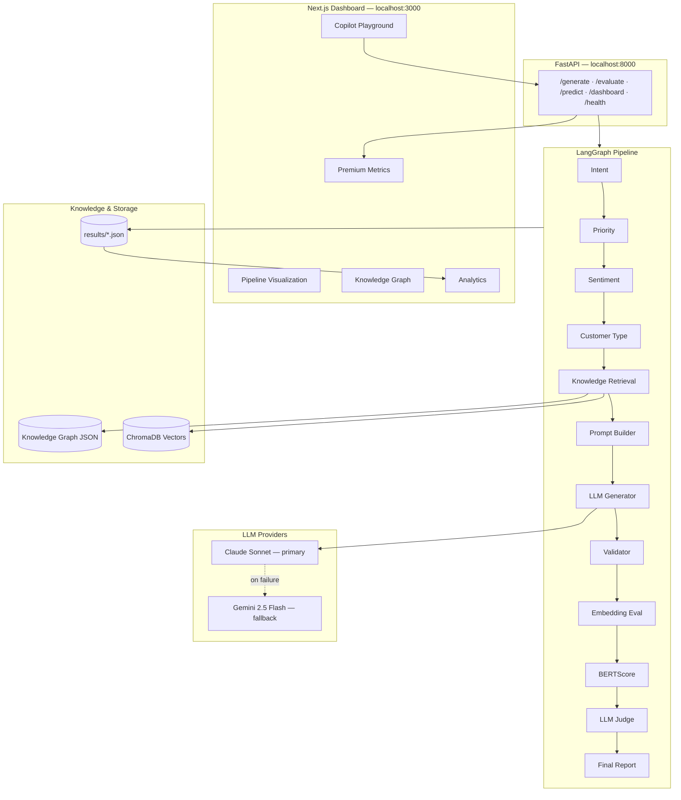

# AI Native Email Intelligence

[](https://github.com/vijayshreepathak/AI-Native-Email-Intelligence)

Production-quality AI email reply platform inspired by **Hiver AI Copilot**. It ingests customer support emails, runs a multi-agent LangGraph pipeline, retrieves company knowledge, generates validated replies, and scores quality with BERTScore, embeddings, and an LLM judge — all exposed through a FastAPI backend and a polished Next.js AI Operations dashboard.

**Repository:** [github.com/vijayshreepathak/AI-Native-Email-Intelligence](https://github.com/vijayshreepathak/AI-Native-Email-Intelligence)

---

## Architecture



### Tech Stack

| Layer | Technology | Role |
|-------|------------|------|
| Orchestration | **LangGraph** | Stateful multi-agent workflow |
| LLM (primary) | **Claude Sonnet 4.6** | Classify, generate, validate, judge |
| LLM (fallback) | **Gemini 2.5 Flash** | Automatic fallback when Claude fails |
| Vector DB | **ChromaDB** | Semantic policy/FAQ retrieval |
| Embeddings | **SentenceTransformers** | Local `all-MiniLM-L6-v2` |
| API | **FastAPI** | Async REST endpoints |
| Dashboard | **Next.js 16 + Framer Motion** | AI Ops console UI |
| Evaluation | **BERTScore + Embeddings + LLM Judge** | Multi-metric quality scoring |

---

## Features

### Backend Pipeline
- **12-node LangGraph workflow** with per-node latency, tokens, and error tracking
- **30 support intents** — billing, refunds, API, security, sync errors, permissions, etc.
- **Knowledge graph traversal** (9 nodes) + ChromaDB vector search (top-3 docs)
- **Structured JSON generation** with citations and confidence scores
- **Validation agent** — hallucination, tone, grammar, completeness, policy compliance
- **LLM judge** — 8 criteria with weighted overall score
- **Gemini fallback** — if Claude key expires or credits run out, pipeline auto-switches to Gemini

### Next.js AI Operations Dashboard
- **Premium metric cards** — AI Quality, latency breakdown, token usage, grounded responses %
- **Copilot Playground** — Generate or Evaluate modes with 8 sample tickets
- **Live pipeline visualization** — animated LangGraph nodes with auto-scroll
- **Interactive knowledge graph** — click nodes for policies, FAQs, templates
- **Retrieval panel** — similarity, matched concepts, index status
- **AI Quality Checklist** — pass/fail gates with 6/7 style scoring
- **LLM Judge panel** — enhanced radar chart + strengths/weaknesses/suggestions
- **Score explainability** — weighted breakdown of why overall = X%
- **Execution timeline** — per-node latency bars
- **Analytics section** — quality trends, grounding, latency, intent distributions
- **Dark/light mode**, keyboard shortcuts, responsive layout

---

## Screenshots

### Platform features
Overview of all capabilities — LangGraph pipeline, RAG, validation, LLM judge, knowledge graph, and REST API.


### Dashboard — generated reply
Copilot Playground with sample tickets. After clicking **Generate Reply**, the right panel shows intent, priority, sentiment, and the AI-drafted response.


### Live pipeline visualization
LangGraph nodes animate in sequence while the pipeline runs — each step shows latency, tokens, and status. Scrolling stays inside the panel.


### Full evaluation
**Evaluate** mode compares the generated reply against a reference response with BERTScore, embedding similarity, and LLM judge scores.


### Analytics
Historical quality trends, grounding scores, latency charts, and intent distributions — scroll down from the playground or use the **Analytics** button.


---

## Quick Start

### 1. Clone & install

```bash
git clone https://github.com/vijayshreepathak/AI-Native-Email-Intelligence.git
cd AI-Native-Email-Intelligence

# Python backend
python -m venv .venv
.venv\Scripts\activate          # Windows
# source .venv/bin/activate     # macOS/Linux
pip install -r requirements.txt

# Frontend dashboard
cd dashboard
npm install
cd ..
```

### 2. Configure environment

```bash
cp .env.example .env
```

Edit `.env`:

```env
ANTHROPIC_API_KEY=your_claude_key          # primary LLM
ANTHROPIC_MODEL=claude-sonnet-4-6
GEMINI_API_KEY=your_gemini_key             # fallback when Claude fails
GEMINI_MODEL=gemini-2.5-flash
```

> **Tip:** If Claude credits expire, the pipeline automatically falls back to Gemini. You only need `GEMINI_API_KEY` set.

### 3. Index knowledge base

```bash
python scripts/embed_knowledge.py embed
```

### 4. Start backend (Terminal 1)

```bash
python cli.py serve
# API → http://127.0.0.1:8000
# Docs → http://127.0.0.1:8000/docs
```

### 5. Start dashboard (Terminal 2)

```bash
cd dashboard
npm run dev
# UI → http://localhost:3000
```

### 6. Try it

1. Open **http://localhost:3000**
2. Click a **Sample Ticket** (e.g. OAuth / Gmail Sync Error)
3. Click **Generate Reply** (~60s) or switch to **Evaluate** for full scoring
4. Explore tabs: **Reply · Pipeline · Graph · Quality · Retrieval · Judge · Insights**
5. Scroll down for **Analytics**

---

## Pipeline Steps

| # | Node | Description |
|---|------|-------------|
| 1 | Intent Agent | Classifies into 30 support intents |
| 2 | Priority Agent | critical / high / medium / low |
| 3 | Sentiment Agent | Customer sentiment analysis |
| 4 | Customer Agent | enterprise, business, pro, etc. |
| 5 | Knowledge Agent | Graph traversal + ChromaDB top-3 retrieval |
| 6 | Prompt Builder | Assembles context-rich prompt |
| 7 | Generator Agent | LLM produces structured JSON reply |
| 8 | Validator Agent | Hallucination, tone, grammar, policy checks |
| 9 | Embedding Evaluation | Cosine similarity vs expected reply |
| 10 | BERTScore | Semantic F1 overlap |
| 11 | LLM Judge | 8-criteria quality assessment |
| 12 | Final Report | Weighted score + feedback |

---

## API Endpoints

| Method | Path | Description |
|--------|------|-------------|
| `GET` | `/health` | Status, model, Chroma index, fallback availability |
| `POST` | `/predict` | Classification only (intent, priority, sentiment) |
| `POST` | `/generate` | Full generation pipeline |
| `POST` | `/evaluate` | Generation + BERTScore + judge + metrics |
| `GET` | `/dashboard` | Aggregated metrics for analytics UI |

### Examples

```bash
# Health
curl http://127.0.0.1:8000/health

# Generate
curl -X POST http://127.0.0.1:8000/generate \
  -H "Content-Type: application/json" \
  -d '{"subject":"Gmail sync broken","email":"Our shared inbox stopped syncing. 12 agents affected.","customer_name":"Maria"}'

# Evaluate
curl -X POST http://127.0.0.1:8000/evaluate \
  -H "Content-Type: application/json" \
  -d '{"subject":"Refund request","email":"I want a pro-rated refund.","expected_response":"Your refund is approved within 5-10 business days."}'
```

---

## LLM Fallback

```
Claude (primary)  →  success  →  use Claude response
                 ↘  failure (expired key, no credits, rate limit)
                    Gemini (fallback)  →  use Gemini response
```

Configured in `app/agents/base.py`. No pipeline changes needed — fallback is transparent to all agents.

---

## Knowledge Graph

9 interconnected nodes in `knowledge/knowledge_graph.json`:

**Billing · Refund · Shipping · Technical · Security · Account · API · Subscription · Permissions**

Each node has policies, FAQs, response templates, escalation rules, and related-node links. Intent-to-node mapping drives targeted retrieval during inference.

---

## Evaluation

| Metric | Weight | Description |
|--------|--------|-------------|
| LLM Judge | 35% | 8 criteria vs expected reply |
| Embedding Similarity | 35% | Sentence embedding cosine similarity |
| BERTScore | 30% | Contextual F1 score |

**Judge criteria:** Correctness, Completeness, Empathy, Professionalism, Actionability, Safety, Hallucination, Policy Adherence

**Validation checks:** No hallucination, action items, professional tone, grammar, completeness, policy compliance

---

## Dataset Generation

```bash
python scripts/generate_dataset.py generate
```

Generates 300 synthetic Hiver-style emails (30 intents × 10). Features incremental checkpoint saves, retry with backoff, deduplication, and train/val/test split.

---

## Project Structure

```
ai-email-intelligence/
├── app/                     # FastAPI + LangGraph backend
│   ├── agents/              # Pipeline agent nodes + LLM client (Claude/Gemini)
│   ├── retriever/           # ChromaDB + knowledge graph
│   ├── evaluation/          # BERTScore, embeddings, judge
│   ├── services/            # Dashboard aggregation
│   └── main.py              # API entry point
├── dashboard/               # Next.js AI Operations UI
│   └── src/
│       ├── app/             # Pages + API routes
│       └── components/      # Pipeline viz, metrics, analytics, etc.
├── knowledge/               # Graph, policies, FAQs, templates, ChromaDB
├── dataset/                 # train / validation / test JSON
├── scripts/                 # embed_knowledge, generate_dataset, test_llm_fallback
├── results/                 # generated.json, evaluation.json, dashboard.json
├── Screenshots/             # UI screenshots for README
├── cli.py                   # Typer CLI
├── requirements.txt
└── README.md
```

---

## CLI

```bash
python cli.py serve --port 8000
python cli.py generate-reply "Subject" "Email body" --name "Customer"
python cli.py evaluate-dataset --split test --limit 5
python scripts/test_llm_fallback.py    # verify Claude → Gemini fallback
```

---

## Tests

```bash
pytest tests/ -v
```

---

## Environment Variables

| Variable | Default | Description |
|----------|---------|-------------|
| `ANTHROPIC_API_KEY` | — | Primary Claude API key |
| `ANTHROPIC_MODEL` | `claude-sonnet-4-6` | Claude model |
| `GEMINI_API_KEY` | — | Fallback Gemini API key |
| `GEMINI_MODEL` | `gemini-2.5-flash` | Gemini model |
| `EMBEDDING_MODEL` | `all-MiniLM-L6-v2` | Sentence transformer |
| `RETRIEVAL_TOP_K` | `3` | Documents retrieved per query |
| `LOG_LEVEL` | `INFO` | Logging verbosity |
| `CORS_ORIGINS` | `http://localhost:3000` | Comma-separated allowed frontend origins |
| `CORS_ORIGIN_REGEX` | `https://.*\.vercel\.app` | Regex for Vercel preview/production URLs |

---

## Deployment

### Backend → [Render](https://render.com)

The repo includes a [Render Blueprint](https://render.com/docs/blueprint-spec) (`render.yaml`).

1. Push the repo to [GitHub](https://github.com/vijayshreepathak/AI-Native-Email-Intelligence)
2. In Render: **New → Blueprint** → connect the repo
3. Set secret env vars in the Render dashboard:
   - `ANTHROPIC_API_KEY` (optional if using Gemini only)
   - `GEMINI_API_KEY`
   - `CORS_ORIGINS` → your Vercel URL, e.g. `https://ai-native-email-intelligence.vercel.app`
4. Deploy — build runs `requirements-prod.txt` + embeds knowledge into ChromaDB
5. Copy the Render URL, e.g. `https://ai-email-intelligence-api.onrender.com`

**Render settings (manual deploy):**

| Setting | Value |
|---------|--------|
| Root Directory | *(repo root)* |
| Build Command | `chmod +x build.sh && ./build.sh` |
| Start Command | `uvicorn app.main:app --host 0.0.0.0 --port $PORT` |
| Health Check | `/health` |
| Plan | **Starter** recommended (512MB+, longer request timeout) |

> Generate/Evaluate requests take **30–120 seconds**. Free Render tiers may timeout — use **Starter** plan or higher.

---

### Frontend → [Vercel](https://vercel.com)

1. Import the GitHub repo in Vercel
2. Set **Root Directory** to `dashboard`
3. Add environment variable:

```env
NEXT_PUBLIC_API_URL=https://your-render-service.onrender.com
```

4. Deploy — Vercel auto-detects Next.js via `dashboard/vercel.json`

**After deploy:** update Render `CORS_ORIGINS` with your exact Vercel production URL (preview deploys are covered by `CORS_ORIGIN_REGEX`).

---

### Verify production

```bash
curl https://your-api.onrender.com/health
# Open https://your-app.vercel.app → Sync → Generate Reply
```

---

## License

MIT — built for the Hiver AI Copilot Challenge.
